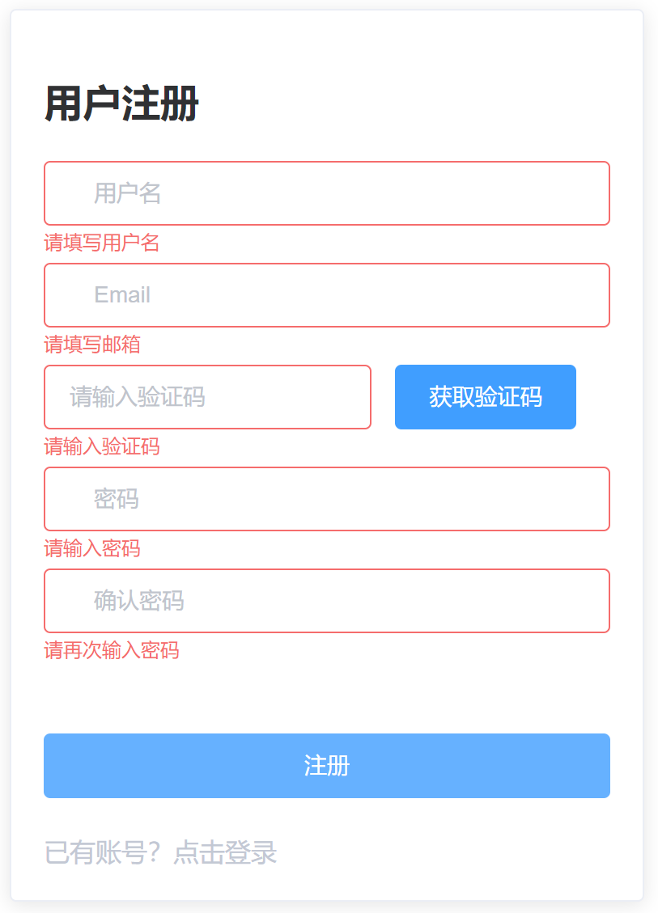
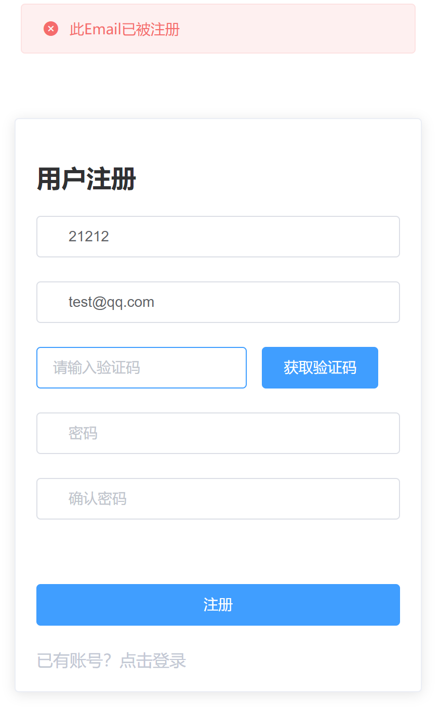
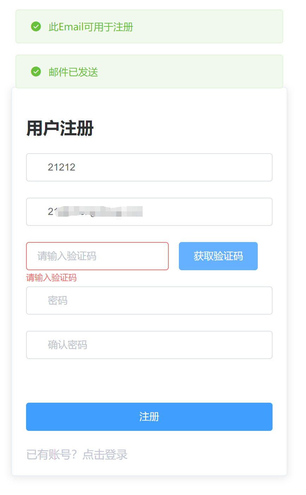
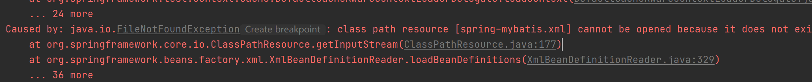
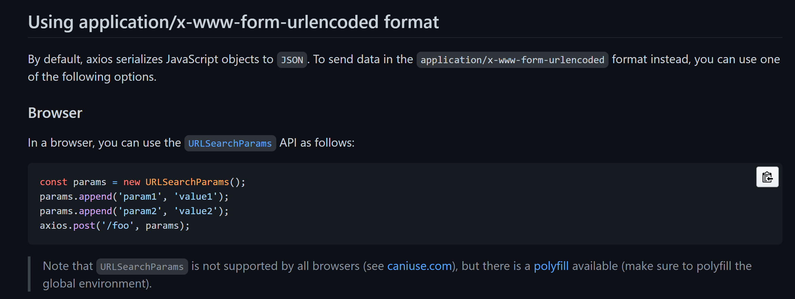
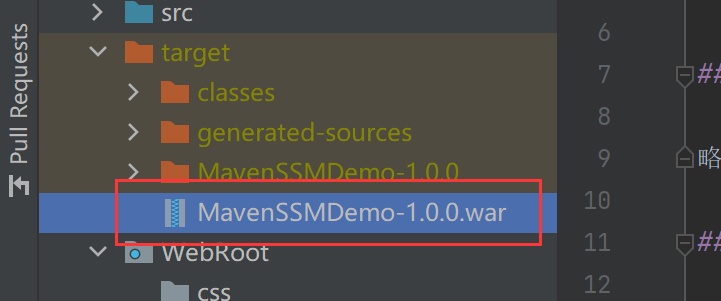
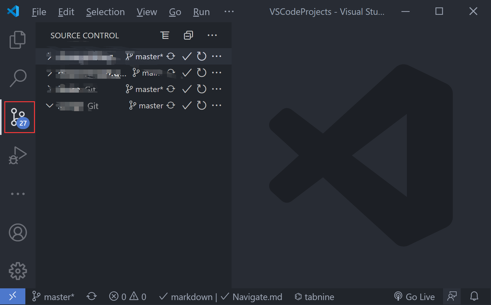
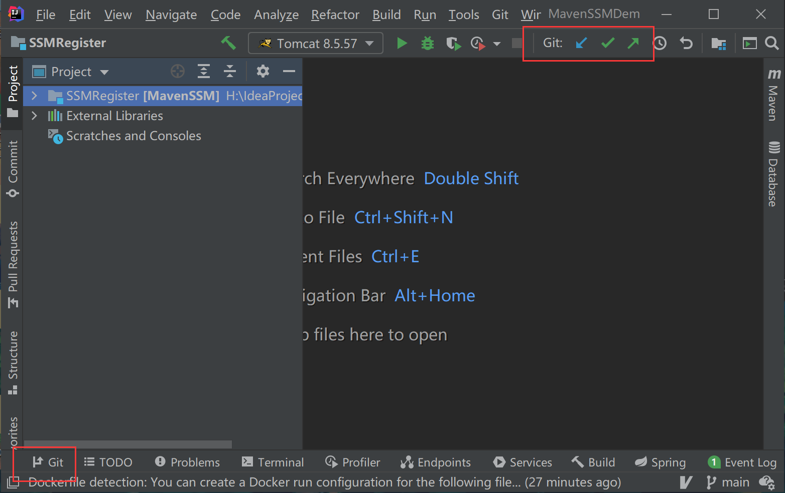

::: tip

基于 SSM Vue ElementUI 的用户注册登录系统

:::

<!-- more -->

## 系统介绍

基于 SSM Vue ElementUI 的用户注册登录系统

后端：SSM 框架

前端：Vue 、ElementUI

数据库：MySQL

部署：Linux CentOS 7 、Docker

开发环境：Windows10 、IntelliJ IDEA 、Tomcat  8.5

### 功能介绍

用户注册登录系统，实现“登陆”、“注册”功能，具体如下：

- 用户注册

  当用户打开注册页面，输入用户名、邮箱、填写邮箱验证码、密码等信息后可以执行注册操作，程序会检验用户的输入是否符合要求，并给出提示信息

- 用户登录

  当用户打开登录页面，输入符合要求的账号密码以及验证码后可以点击登录，会检验用户的输入是否符合要求，并给出提示信息

图例

> 输入是否为空检测



> 后台发送 Ajax 请求判断邮箱是否已经被注册



> 邮件发送成功



### 技术介绍

#### 后端

SSM 框架：Spring SpringMVC Mybatis


Spring

> Spring 框架的核心特性是依赖注入(DI)与面向切面编程(AOP)，Spring 框架可以看作是一个控制反转的容器。尽管 Spring 主要用于 JEE 应用开发，但实际上这 2 个核心特性可用于任何 Java 项目。
>
> Spring 框架是 Java EE 开发中最流行的框架，已经成为 JEE 事实上的标准，全世界的开发人员都在使用 Spring 框架开发各种应用

- 依赖注入：代码中使用 `@Autowired` 注解，不需要手动 new 一个对象，也可以称之为控制反转（Inversion of Control IoC）


SpringMVC

> SpringWeb MVC 是一种基于 Java 的使用了 MVC 架构模式的思想，将 web 层进行解耦，基于请求-响应模型帮助我们简化日常 web 系统的开发


Mybatis

> MyBatis 是一款优秀的持久层框架，可以通过简单的 XML 或注解来配置和映射原始类型、接口


#### 前端

Vue.js

> Vue (读音 /vjuː/，类似于 view) 是一套用于构建用户界面的渐进式框架。Vue 的核心库只关注视图层，不仅易于上手，还便于与第三方库或既有项目整合。


ElementUI

> 网站快速成型工具
> Element，一套为开发者、设计师和产品经理准备的基于 Vue 2.0 的桌面端组件库


#### 数据库

MySQL

> MySQL 是一个轻量级关系型数据库管理系统，由于体积小、速度快、总体拥有成本低，开放源码、免费，一般中小型网站的开发都选择 Linux + MySQL 作为网站数据库

#### 项目部署

CentOS 7

> 由 Red Hat 公司发布、完全开源的 Linux 发行版

Docker

> 1. 通过容器化技术使服务器的部署环境和开发环境一致。不会因为环境不一致导致程序运行失败
>
> 2. 和虚拟机不同，它的特点有 **启动快** **资源占用少** **体积小**
> 3. 运行其他人配制好的镜像，最少只需要一行命令

### 关键问题解决

完成本次项目遇到了很多问题，前端、后端、数据库、项目部署每一部分的问题都有

不过最关键的几个问题如下，这些问题延误了完成进度

#### 后端和数据库

> 源码：[SSMRegister/src at main · DayoWong0/SSMRegister](https://github.com/DayoWong0/SSMRegister/tree/main/src)

##### 项目建立

参考web应用开发教案编写项目配置文件，反复操作了几次，运行测试时失败，最终放弃了自己配置，将老师上课给的 MavenSSM 示例项目导入 IDEA

错误例子：



​	报错信息显示有个文件没有读取到，但是检查过路径没问题

1. 第一次运行测试数据库查询报错

   解决：jdbc.properties url 追加下面的语句，是因为使用了最新版本的 MySQL

   ```properties
   &allowPublicKeyRetrieval=true
   ```

##### SSM 框架不熟悉

> 花了半天时间看了 web 应用开发教案、查阅 MyBatis 文档

> 刚开始DAO 设计模式中 DAO 和 Service 的区别理解不到位，后面随着代码写多了，自然明白了

##### 手机短信 API

> 申请过阿里云的短信 API，审核未通过，改用发邮件的方式发送注册验证码

#### 前端

> 注册页面源码：[SSMRegister/register.html at main · DayoWong0/SSMRegister](https://github.com/DayoWong0/SSMRegister/blob/main/WebRoot/register.html)

> 登录页面源码：[SSMRegister/login.html at main · DayoWong0/SSMRegister](https://github.com/DayoWong0/SSMRegister/blob/main/WebRoot/login.html)

1. ElementUI 之前没用过。由于之前学过 Vue 入门教程，整体看了一次 Vue 文档，再去看 ElementUI 的官方文档，配合着示例代码，过了一遍上面的例子

2. 用 Vue 官方推荐的网络请求库 axios 发送 POST数据，后端 Controller 收不到。上网搜索到了 axios 官方文档的解决办法

   [axios/README.md](https://github.com/axios/axios/blob/master/README.md#using-applicationx-www-form-urlencoded-format)

   axios 文档里给的解决办法

   

#### 项目部署

> 完整步骤：[SSMRegister/Deploy.md at main](https://github.com/DayoWong0/SSMRegister/blob/main/Deploy.md)

##### 虚拟目录配置

> 如果使用默认配置，需要访问 `ip:端口/项目名称/register.html`
>
> 修改后只需要 `ip:端口/register.html`

看了 web应用开发教案配置方法3

修改 server.xml 配置文件

`<Host> </Host>`标签内加入下面这句

docBase 为项目名称的绝对路径，MavenSSMDemo-1.0.0 为我部署的项目的文件名，没有后缀 .war



```xml
<!-- 去掉项目名称 -->
<Context path="" docBase="/usr/local/tomcat/webapps/MavenSSMDemo-1.0.0" debug="0" reloadable="true"/>
```

## 系统演示

- [注册页面](http://47.101.136.94:8080/register.html)
- [登录页面](http://47.101.136.94:8080/login.html)

## 建议

### 学习建议

1. 快速入门：可以在 bilibili 上搜相关视频入门

2. 入门后多看官方文档，可以先整体看一遍文档，对内容有大致印象，记住是不可能记住的，需要用的时候，再去查文档

3. 找一本评分高的书籍阅读，一本好书会让你看上瘾的。比如这学期我看过的 《 C Primer Plus 》 以及 《 第一行代码—Android（第二版）》，阅读体验极好， 第一行代码第三版今年出版了，现在正在阅读中

4. 一定得实战，将学过的知识利用起来。首先试着理解代码的思路，看一遍书上代码，关上书，敲一遍书上的代码，看哪个地方没印象，这比拿到源码 ctrl c + ctrl v 有效多了，接着完成相关的作业

5. 写点笔记记录学习过程中遇到的问题或者知识总结，方便以后查询

   看一本书或者视频教程的时间代价挺大的，笔记有助于你回忆起相关知识

   - [WindrunnerMax](https://blog.touchczy.top/#/)
   - [WindrunnerMax/EveryDay: 前端基础 个人博客 学习笔记](https://github.com/WindrunnerMax/EveryDay)

### 其他

### Git 以及 GitHub 的使用

大部分同学都是使用 Github 网页端上传文件交的作业，有上传文件数量限制，不能在网页端修改文件目录名等限制。各种 IDE 里都有 git 图形操作界面，当然你也可以选择使用命令

- [Git 教程 - 廖雪峰的官方网站](https://www.liaoxuefeng.com/wiki/896043488029600)

- [GitHub 不完全指南](https://mp.weixin.qq.com/s/7RbB1Vs8ILUcEdujzIE1rg)

- VSCode 中的 Git 操作界面

  

- IDEA 中的 Git 操作界面

  

### MarkDown

> Github 上项目文档 README.md 都是用的 Markdown

优点

- 专注你的文字内容而不是排版样式，安心写作。
- 轻松的导出 HTML、PDF 和本身的.md 文件。
- 随时修改你的文章版本，不必像字处理软件生成若干文件版本导致混乱。
- 可读、直观、学习成本低

### 合理利用搜索引擎


---

| 什么鬼？    | 咋回事？    | 怎么办？    | 救命啊！！       |
| ----------- | ----------- | ----------- | ---------------- |
| 自己 google | 自己 google | 自己 google | 自己 google 了吗 |


### 正确的提问姿势


## 参考

- 文档编写
  - [Markdown 中支持的语法 | vuepress-theme-reco](https://vuepress-theme-reco.recoluan.com/views/1.x/syntax.html)
- 前端
- 后端
  - [Connection Java-MySql : Public Key Retrieval is not allowed - Stack Overflow](https://stackoverflow.com/questions/50379839/connection-java-mysql-public-key-retrieval-is-not-allowed)
  - [关于JDBC连接数据库时出现的Public Key Retrieval is not allowed错误](https://blog.csdn.net/Yuriey/article/details/80423504)
- 部署

  - [Docker-制作 Spring MVC 工程镜像-阿里云开发者社区](https://developer.aliyun.com/article/652952)
- 官方文档

  - [Web on Servlet Stack](https://docs.spring.io/spring-framework/docs/current/reference/html/web.html)

  - [mybatis – MyBatis 3 | 简介](https://mybatis.org/mybatis-3/zh/index.html)
- 提问
  - [Stop-Ask-Questions-The-Stupid-Ways/README.md at master · tangx/Stop-Ask-Questions-The-Stupid-Ways](https://github.com/tangx/Stop-Ask-Questions-The-Stupid-Ways/blob/master/README.md)
