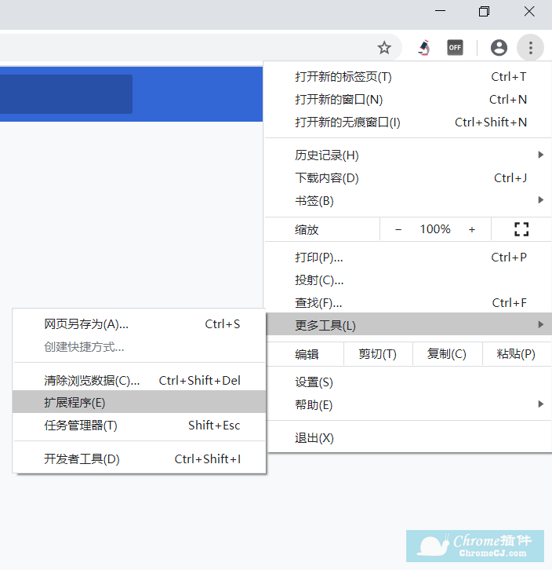

# 解除 encoreTVB 地区限制插件

## encoreTVB 介绍

这个网站是 美国 TVB 官方出品的，网站里可以看到许多经典的港剧，最近上映的电视剧也是隔日更新的，相比于类似 TVBAnywhere 来说，此网站是完全免费的，它的盈利是靠广告，但是仅允许美国 IP 地址观看，通过此插件可以解除这一限制。虽然最近几年 TVB 开始没落了，但以前的高分或者经典剧集还是值得一看的。

比如说博主比较喜欢的剧

- [张卫健版西游记 1](https://encoretvb.com/cantonese/series/Eo6znTIB-Journey_To_The_West)

- [EU 超時任務](https://encoretvb.com/cantonese/series/BASuOUN5-Over_Run_Over)

- [潜行狙击](https://encoretvb.com/cantonese/series/1176-Lives_of_Omission)

- [大时代](https://encoretvb.com/cantonese/series/o3y6OY7w-The_Greed_of_Man)

- [天与地](https://encoretvb.com/cantonese/videos/1752-When_Heaven_Burns/6234971168001)

- [使徒行者](https://encoretvb.com/cantonese/series/t0KwnHFn-Line_Walker)

- [宫心计](https://encoretvb.com/cantonese/series/K18K7Fin-Beyond_The_Realm_Of_Conscience)

- [封神榜](https://encoretvb.com/cantonese/series/1348-Gods_of_Honour)

## 插件介绍

本项目地址 [Unblock-TVB](https://github.com/DayoWong0/Unblock-TVB)

此插件拦截了浏览器对 encoreTVB 网站发起的部分请求，修改了请求头后放行，以达到解除地域限制的目的。仅在 Chrome 上测试过，为保证效果，建议使用 Chrome 浏览器

## 插件安装

### 下载插件

打开链接 [Unblock encoreTVB](https://github.com/DayoWong0/Unblock-TVB/releases/tag/v1.0)

点击下载，下载之后将文件夹解压

### 安装

1、首先打开 chrome 浏览器——点击三点按钮——更多工具——扩展程序。

2、在打开页面的右上角找到开发者模式点击打开

3、在扩展程序界面点击【加载已解压的扩展程序】，找到刚刚解压出来对应的【文件夹】即可。

注意：要选择到 `Unblock-TVB-master` 这个文件夹

点击`选择文件夹`安装完成后即可使用，打开 [encoretvb.com](https://encoretvb.com) 便可以愉快的看剧了，

由于此网站服务器位于美国，加载网页时速度可能不快，但是看视频的时候网速不错，因为网页服务器位于美国，而视频服务器有 CDN 加速，经过本人半年的使用体验来说，体验一级棒，视频画质就 720P 勉强凑合。

## 参考

[如何给谷歌浏览器添加 chrome 插件？](https://huajiakeji.com/utilities/2020-07/3344.html)

[Unblock-TVB](https://github.com/smqsrgswc/Unblock-TVB)
